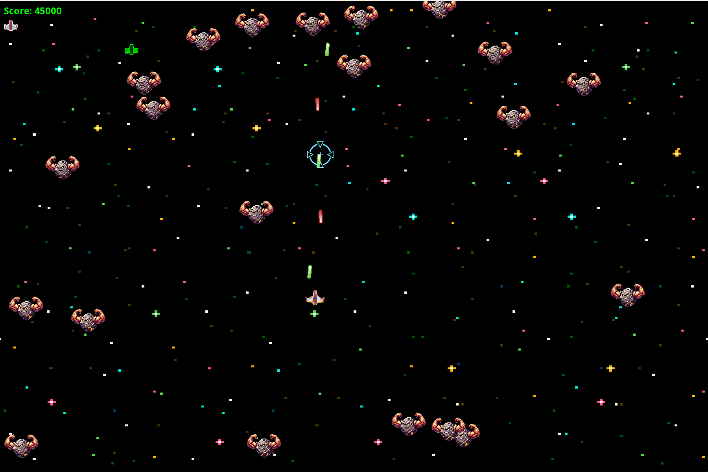
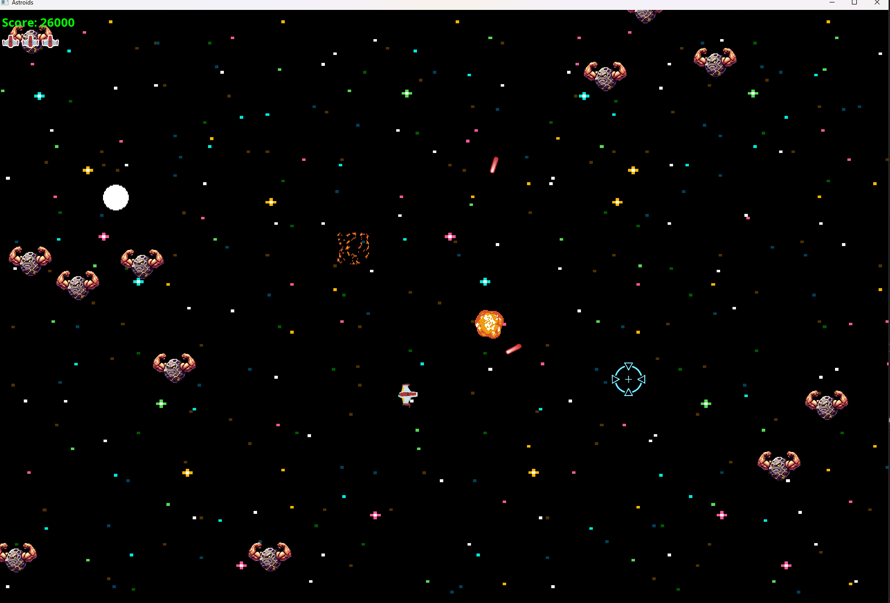
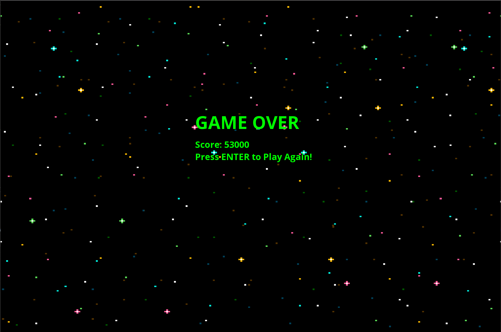

#  Astroids

"Astroids" is a 2D game engine project inspired by the classic arcade game Asteroids. Developed in C++ using SFML for rendering and Box2D for collision simulation, the project is built around a custom architecture featuring a centralized GameManager and a flexible GameObject system. These components form the foundation of the engine, enabling modular and reusable features for rendering, physics, and input handling.

This project allowed me to dive deep into game engine architecture, prioritizing scalability and maintainability over relying on prebuilt engines like Unity or Unreal. It reflects my commitment to understanding the core mechanics of game development from the ground up.

And yes, the "Astroids" do have muscular arms! What started as a typo became a unique feature, embracing the concept of gym-loving, buff space rocks. Below are several screenshots showcasing the game and its quirky twist.

## Pictures

## Features

- **Rendering**: Powered by [SFML (Simple and Fast Multimedia Library)](https://www.sfml-dev.org/) for graphics.
- **Physics**: Realistic simulations using [Box2D](https://box2d.org/).
- **Collision Detection**: Precise handling for player ship, projectiles, and asteroids.
- **User Interface**: Basic UI for score and lives, built with SFML and ImGui.
- **Parallaxing**: Dynamic background effects for depth and immersion.

## Development Process

The development of this project involved several key steps:

1. **Setting Up the Development Environment**: Integrated SFML and Box2D for seamless development.
2. **Implementing Core Mechanics**: Implemented player controls, asteroid generation, and movement.
3. **Rendering Graphics**: Used SFML for object rendering, animations, and parallax effects.
4. **Building a Flexible Architecture**: Designed a component-based system for modular and reusable behaviors.
5. **User Interface**: Created interfaces for displaying critical game data like scores and lives.
   
Challenges and Solutions

## Challenges and Solutions

- **Flexible GameObject Design**  
  - **Challenge**: Avoiding logic duplication across entities (e.g., Player, Enemy, Projectile). 
  - **Solution**: Developed a single, versatile GameObject class with independent components.

- **Decoupled Behaviors**  
  - **Challenge**: Preventing tightly coupled code for various behaviors (e.g., rendering, physics).
  - **Solution**: Adopted a component-based system for reusable, extensible functionality.

- **Debugging Challenges**  
  - **Challenge**: Cumbersome frame-by-frame debugging of GameObjects and components.  
  - **Solution**: Integrated ImGui for real-time inspection and modification during runtime.

- **Hierarchical Relationships**  
  - **Challenge**: Managing dependencies between parent and child GameObjects (e.g., projectiles tied to a player).  
  - **Solution**: Introduced a hierarchical structure with parent-child relationships managed by the GameManager.

- **Efficient Collision Detection**  
  - **Challenge**: Custom collision detection was slow and inefficient.  
  - **Solution**: Replaced custom collision logic with Box2D’s built-in collision detection system for robustness and performance.

- **Asset Loading Stutters**  
  - **Challenge**: Spawning multiple GameObjects (e.g., 25 enemies from a Bomb drop) caused stuttering due to loading assets directly from disk during gameplay.  
  - **Solution**: Implemented a Resource Manager to preload assets, enabling GameObjects to share textures and reduce runtime overhead.

- **Flat Visuals**  
  - **Challenge**: The game world felt static and lacked depth.  
  - **Solution**: Added parallax effects for a more dynamic and engaging background.
